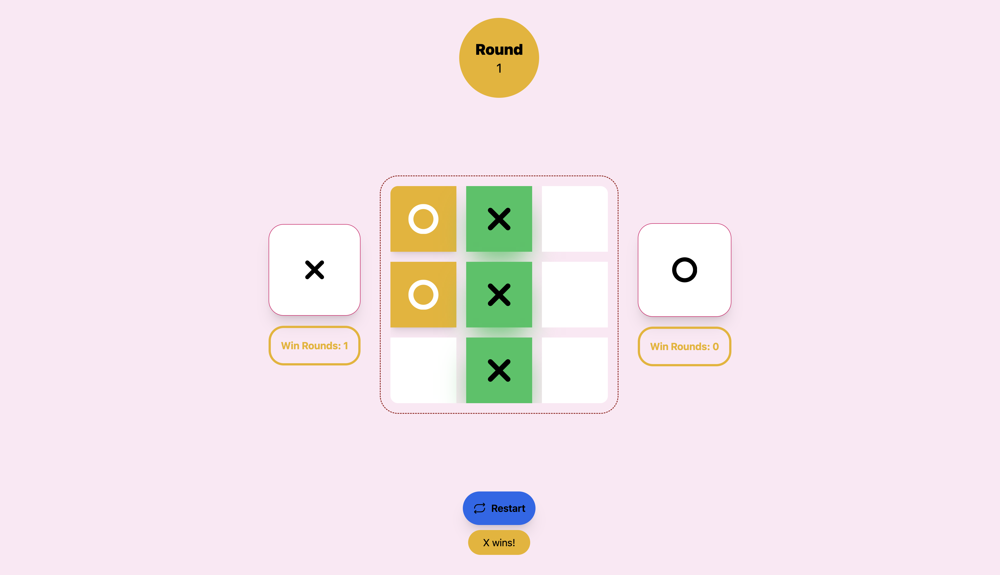

# Tic-Tac-Toe Game with Ember.js, XState, and Tailwind CSS

## Introduction

This project implements the classic game of Tic-Tac-Toe using Ember.js, XState, and Tailwind CSS. The purpose of this project is to demonstrate my front-end development skills, including state management with XState, component-driven architecture with Ember.js, and styling with Tailwind CSS.

## Project Overview

### Technologies Used
- **Ember.js**: A robust framework for building ambitious web applications.
- **XState**: A state management library using state machines and statecharts.
- **Tailwind CSS**: A utility-first CSS framework for rapid UI development.

### State Management with XState
We used XState to manage the game state, ensuring a clear and predictable flow of the game. The state machine handles the following states:

- playing: The state during the game.
- finished: The state when a player wins.
- draw: The state when the game ends in a draw.

## Installation

- `git clone <repository-url>` this repository
- `cd ff`
- `npm install`

## Running / Development

- `npm run start`
- Visit your app at [http://localhost:4200](http://localhost:4200).

### Code Generators

Make use of the many generators for code, try `ember help generate` for more details

### Running Tests

- `npm run test`
- `npm run test:ember -- --server`

### Linting

- `npm run lint`
- `npm run lint:fix`

### Building

- `npm exec ember build` (development)
- `npm run build` (production)

